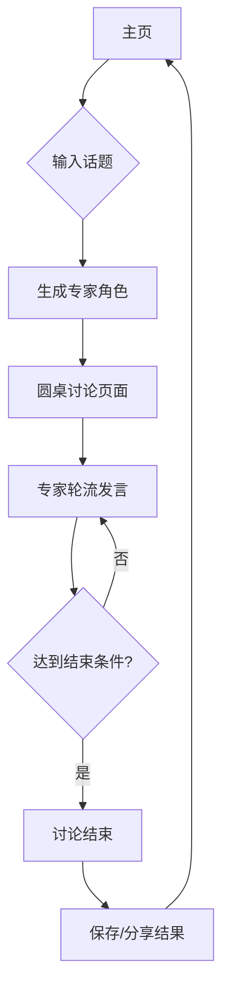

## 1. 产品概述
AI圆桌是一个可视化的人工智能专家讨论平台。用户输入一个话题后，系统自动生成5-6个不同领域的AI专家角色，这些专家围绕圆桌进行深度讨论，用户可以以聊天气泡的形式实时观察他们的思维碰撞和观点交流。

产品价值：通过多角度的AI专家讨论，为用户提供更全面、深入的话题分析，同时以直观的可视化方式展现AI思维过程。

## 2. 核心功能

### 2.1 用户角色
| 角色 | 注册方式 | 核心权限 |
|------|----------|----------|
| 访客用户 | 无需注册 | 发起话题讨论、观看AI专家讨论 |
| 注册用户 | 邮箱注册 | 保存讨论历史、自定义专家角色、导出讨论内容 |

### 2.2 功能模块
核心页面包括：
1. **主页**：话题输入、讨论参数设置、开始讨论按钮
2. **圆桌讨论页**：专家角色展示、实时讨论可视化、讨论控制面板
3. **历史记录页**：过往讨论记录、讨论内容回放

### 2.3 页面详情
| 页面名称 | 模块名称 | 功能描述 |
|----------|----------|----------|
| 主页 | 话题输入区 | 输入讨论话题，支持文本输入和话题建议 |
| 主页 | 参数设置区 | 设置专家数量(5-6个)、讨论轮次、讨论目标 |
| 主页 | 历史记录入口 | 查看历史讨论记录 |
| 圆桌讨论页 | 专家角色展示区 | 圆形排列的专家头像、姓名、专业领域 |
| 圆桌讨论页 | 讨论可视化区 | 聊天气泡显示发言内容，按发言顺序排列 |
| 圆桌讨论页 | 实时控制面板 | 暂停/继续讨论、调整讨论速度、手动干预 |
| 圆桌讨论页 | 讨论状态指示器 | 显示当前发言者、讨论轮次、达成共识进度 |
| 历史记录页 | 讨论列表 | 显示历史讨论的话题、时间、参与专家 |
| 历史记录页 | 讨论回放 | 重新播放完整的讨论过程 |

## 3. 核心流程

### 用户操作流程
1. 用户进入主页，输入讨论话题
2. 系统自动生成专家角色（包括姓名、头像、专业背景）
3. 用户确认后开始讨论，进入圆桌讨论页面
4. AI专家按顺序发言，系统实时显示聊天气泡
5. 讨论持续进行，直到达到预设的轮次或达成共识
6. 用户可以随时暂停、调整或结束讨论
7. 讨论结束后，用户可保存讨论内容或重新开始

### 系统处理流程
1. 接收用户话题，调用DeepSeek API生成专家角色
2. 为每个专家角色生成初始观点和立场
3. 按轮次组织专家发言，每次发言考虑前面专家的观点
4. 评估讨论进度，判断是否达到结束条件
5. 实时更新可视化界面，展示讨论过程

## 4. 用户界面设计

### 4.1 设计风格
- **主色调**：深蓝色(#1e3a8a)搭配银色(#c0c0c0)，体现专业和科技感
- **按钮样式**：圆角矩形，悬停效果，3D阴影
- **字体**：中文使用思源黑体，英文使用Roboto，正文字号14-16px
- **布局风格**：卡片式布局，中心对称的圆桌设计
- **图标风格**：扁平化设计，使用圆形头像配合专业标识

### 4.2 页面设计概述
| 页面名称 | 模块名称 | UI元素 |
|----------|----------|--------|
| 主页 | 话题输入区 | 大尺寸文本输入框，带有话题建议下拉列表，输入框周围有动态光效 |
| 主页 | 参数设置区 | 滑块控制专家数量，下拉选择讨论深度，现代化开关按钮 |
| 圆桌讨论页 | 专家展示区 | 圆形排列的专家头像，每个头像下方显示姓名和专业领域，发言时头像高亮 |
| 圆桌讨论页 | 聊天气泡区 | 半透明气泡从发言专家位置弹出，按时间顺序排列，支持滚动查看 |
| 圆桌讨论页 | 控制面板 | 浮动工具栏，包含播放/暂停、速度调节、手动干预按钮 |

### 4.3 响应式设计
- 桌面端优先设计，支持1920x1080及以上分辨率
- 平板端自适应，专家头像重新排列为半圆形
- 手机端优化，采用垂直滚动布局，专家头像排列在顶部

### 4.4 动效设计
- 专家发言时头像脉冲动画
- 聊天气泡弹出弹性动画
- 圆桌背景 subtle 旋转效果
- 页面切换平滑过渡效果