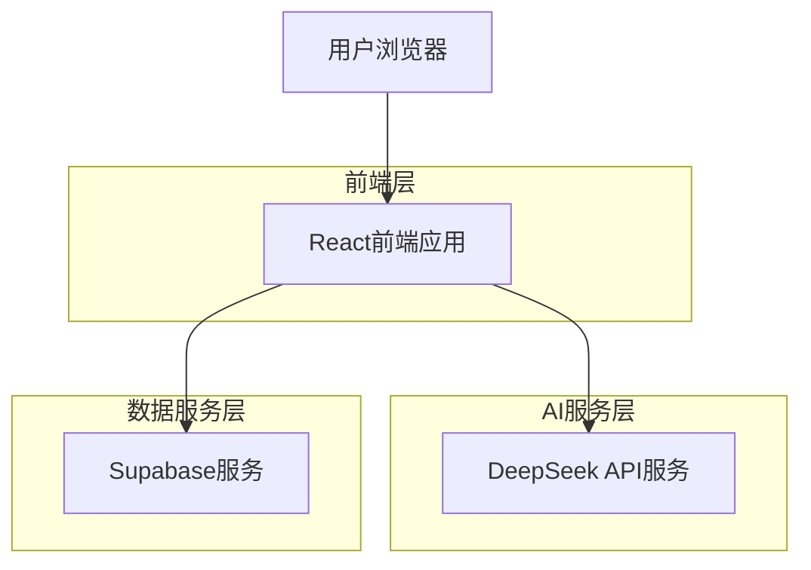
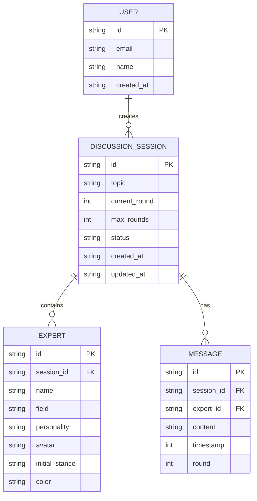
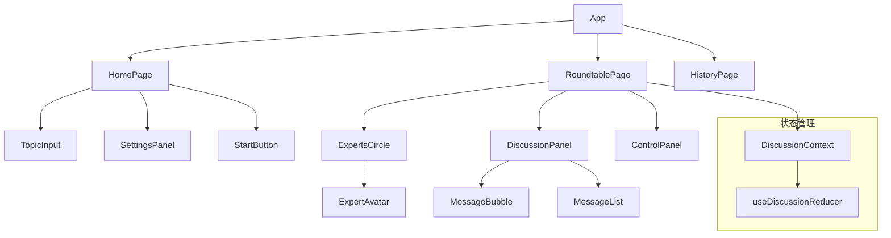
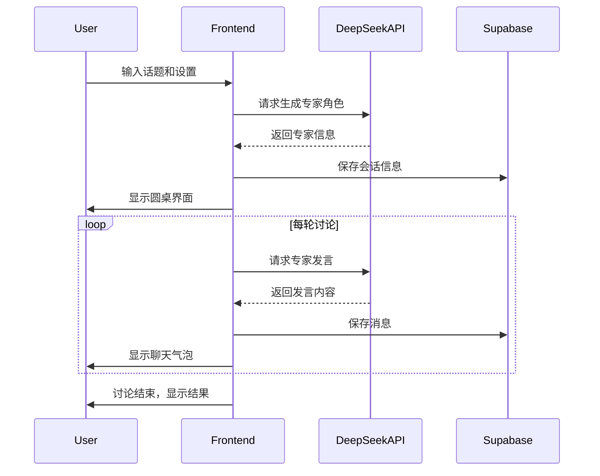

## 1. 架构设计



## 2. 技术描述

- **前端**: React@18 + Tailwind CSS@3 + Vite
- **初始化工具**: vite-init
- **后端**: 无独立后端，直接调用DeepSeek API
- **数据库**: Supabase (PostgreSQL) - 用于存储讨论历史和用户数据
- **状态管理**: React Context + useReducer
- **HTTP客户端**: axios
- **UI组件库**: Headless UI + 自定义组件

## 3. 路由定义

| 路由 | 用途 |
|------|------|
| / | 主页，话题输入和参数设置 |
| /roundtable/:sessionId | 圆桌讨论页面，实时显示AI专家讨论 |
| /history | 历史记录页面，查看过往讨论 |
| /history/:sessionId | 讨论详情页面，回放具体讨论内容 |

## 4. API定义

### 4.1 DeepSeek API集成

专家角色生成
```
POST https://api.deepseek.com/v1/chat/completions
```

请求体：
```json
{
  "model": "deepseek-chat",
  "messages": [
    {
      "role": "system",
      "content": "根据给定话题生成5-6个不同领域的专家角色，每个角色包含姓名、专业领域、性格特点、初始观点。返回JSON格式。"
    },
    {
      "role": "user", 
      "content": "话题：{topic}"
    }
  ],
  "temperature": 0.7
}
```

专家发言生成
```
POST https://api.deepseek.com/v1/chat/completions
```

请求体：
```json
{
  "model": "deepseek-chat",
  "messages": [
    {
      "role": "system",
      "content": "你是一个{role}专家，名字叫{name}，专业领域是{field}，性格特点是{personality}。请基于前面的讨论发表你的观点。"
    },
    {
      "role": "user",
      "content": "讨论话题：{topic}，前面专家观点：{previousOpinions}"
    }
  ],
  "temperature": 0.8
}
```

### 4.2 前端类型定义

```typescript
interface Expert {
  id: string;
  name: string;
  field: string;
  personality: string;
  avatar: string;
  initialStance: string;
  color: string;
}

interface DiscussionMessage {
  id: string;
  expertId: string;
  content: string;
  timestamp: number;
  round: number;
}

interface DiscussionSession {
  id: string;
  topic: string;
  experts: Expert[];
  messages: DiscussionMessage[];
  currentRound: number;
  maxRounds: number;
  status: 'pending' | 'active' | 'paused' | 'completed';
  createdAt: string;
  updatedAt: string;
}

interface DiscussionSettings {
  topic: string;
  expertCount: number;
  maxRounds: number;
  discussionGoal: 'consensus' | 'exploration' | 'debate';
}
```

## 5. 数据模型

### 5.1 数据模型定义



### 5.2 数据定义语言

讨论会话表 (discussion_sessions)
```sql
-- 创建表
CREATE TABLE discussion_sessions (
    id UUID PRIMARY KEY DEFAULT gen_random_uuid(),
    topic VARCHAR(500) NOT NULL,
    current_round INTEGER DEFAULT 1,
    max_rounds INTEGER DEFAULT 5,
    status VARCHAR(20) DEFAULT 'pending' CHECK (status IN ('pending', 'active', 'paused', 'completed')),
    user_id UUID REFERENCES auth.users(id),
    created_at TIMESTAMP WITH TIME ZONE DEFAULT NOW(),
    updated_at TIMESTAMP WITH TIME ZONE DEFAULT NOW()
);

-- 创建索引
CREATE INDEX idx_discussion_sessions_user_id ON discussion_sessions(user_id);
CREATE INDEX idx_discussion_sessions_status ON discussion_sessions(status);
CREATE INDEX idx_discussion_sessions_created_at ON discussion_sessions(created_at DESC);
```

专家表 (experts)
```sql
-- 创建表
CREATE TABLE experts (
    id UUID PRIMARY KEY DEFAULT gen_random_uuid(),
    session_id UUID REFERENCES discussion_sessions(id) ON DELETE CASCADE,
    name VARCHAR(100) NOT NULL,
    field VARCHAR(200) NOT NULL,
    personality VARCHAR(500),
    avatar VARCHAR(500),
    initial_stance TEXT,
    color VARCHAR(7) NOT NULL,
    created_at TIMESTAMP WITH TIME ZONE DEFAULT NOW()
);

-- 创建索引
CREATE INDEX idx_experts_session_id ON experts(session_id);
```

消息表 (messages)
```sql
-- 创建表
CREATE TABLE messages (
    id UUID PRIMARY KEY DEFAULT gen_random_uuid(),
    session_id UUID REFERENCES discussion_sessions(id) ON DELETE CASCADE,
    expert_id UUID REFERENCES experts(id) ON DELETE CASCADE,
    content TEXT NOT NULL,
    timestamp BIGINT NOT NULL,
    round INTEGER NOT NULL,
    created_at TIMESTAMP WITH TIME ZONE DEFAULT NOW()
);

-- 创建索引
CREATE INDEX idx_messages_session_id ON messages(session_id);
CREATE INDEX idx_messages_expert_id ON messages(expert_id);
CREATE INDEX idx_messages_timestamp ON messages(timestamp);
CREATE INDEX idx_messages_round ON messages(round);
```

### 5.3 Supabase权限设置

```sql
-- 基本权限设置
GRANT SELECT ON discussion_sessions TO anon;
GRANT SELECT ON experts TO anon;
GRANT SELECT ON messages TO anon;

GRANT ALL PRIVILEGES ON discussion_sessions TO authenticated;
GRANT ALL PRIVILEGES ON experts TO authenticated;
GRANT ALL PRIVILEGES ON messages TO authenticated;

-- RLS策略（基于用户身份验证）
ALTER TABLE discussion_sessions ENABLE ROW LEVEL SECURITY;
ALTER TABLE experts ENABLE ROW LEVEL SECURITY;
ALTER TABLE messages ENABLE ROW LEVEL SECURITY;

-- 用户只能查看自己的会话（匿名用户可查看公开会话）
CREATE POLICY "Users can view own sessions" ON discussion_sessions
    FOR SELECT USING (auth.uid() = user_id OR status = 'completed');

CREATE POLICY "Users can manage own sessions" ON discussion_sessions
    FOR ALL USING (auth.uid() = user_id);

-- 专家角色和消息继承会话权限
CREATE POLICY "Experts visible to session viewers" ON experts
    FOR SELECT USING (
        EXISTS (
            SELECT 1 FROM discussion_sessions 
            WHERE id = experts.session_id 
            AND (auth.uid() = user_id OR status = 'completed')
        )
    );

CREATE POLICY "Messages visible to session viewers" ON messages
    FOR SELECT USING (
        EXISTS (
            SELECT 1 FROM discussion_sessions 
            WHERE id = messages.session_id 
            AND (auth.uid() = user_id OR status = 'completed')
        )
    );
```

## 6. 核心组件架构

### 6.1 前端组件结构



### 6.2 讨论流程控制

